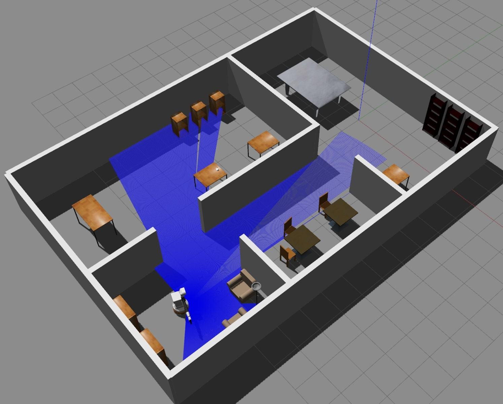

# Mobile Manipulation Mission Planner Project

Part of course (DD2410) work <br>



# Discription

A Gazebo simulation of a TIAGo robot localizing in a previously mapped apartment. The robot has several onboard sensors and a manipulator which enable it to navigate and interact with the environment through simple manipulation tasks. <br>

The project uses (ROS) and the robot has modules for path planning, control, localization, sensing, and manipulation. The main mission is to navigate to a specific location to pick up an object, then transport it to a different target location. <br>

Made use of the available sensors and actuator through the software packages provided to accomplish the goal. In the localization step, the robot spins around to gather as much information as possible from the enviroment using the sensors. The localization is done by using a particle filter. Random distribution of poses of the robot gets scattered across the map, then each one of them gets evaluated to find out how likely it is the true pose
The least likely ones get deleted, and the most likely ones are used to generate poses nearby in a reiterative manner to find out the correct pose <br>

ARUCO markers were used to find the cube's pose. Once the robot can see the marker, it can target it's location with the manipulator. State Machine and Behaviour Tree were both used as models for the robots behaviour. The robot has the capability to recognize when it is kidnapped, and relocalizes when it occurs

[LINK TO SIMULATION VIDEO](https://www.youtube.com/watch?v=K5JCUoVxqic)

## Install
Run the following commands in a terminal:
```
$ cd ~/catkin_ws/src
$ git clone "this_repo_link" "folder_name"
$ cd 
$ rosdep install --from-paths catkin_ws --ignore-src --rosdistro=$ROS_DISTRO -y
$ cd ~/catkin_ws
$ catkin_make -DCATKIN_ENABLE_TESTING=0 -DCMAKE_BUILD_TYPE=RelWithDebInfo
$ source devel/setup.bash
```
## Run
In order to run the system:
```
$ roslaunch robotics_project gazebo_project.launch
$ roslaunch robotics_project launch_project.launch
```

## License

This project is licensed under the Modified BSD License - see [LICENSE](https://opensource.org/licenses/BSD-3-Clause) for details
